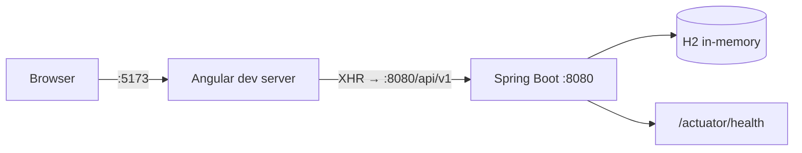
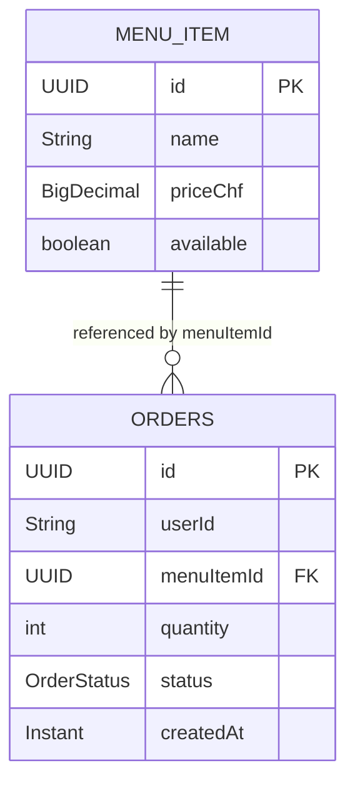

# Architecture Design Document — Lunch Order API

| Field | Value |
| --- | --- |
| **Project** | AI-Training (Lunch Order API) |
| **Status** | Current as of 2026-09-03 |
| **Scope** | Feature 1 — Spring Boot backend · Feature 2 — Angular browser client |
| **Machine contract** | [`architecture/ARCHITECTURE-SPINE.md`](architecture/ARCHITECTURE-SPINE.md) — 18 ADs, the binding invariants |
| **Decision trail** | `architecture/.memlog.md` — append-only, 42 entries |
| **Supersedes** | `docs/tech-spec.md` (Phase 3 artefact, 2026-05-11 — backend-only, now stale) |

> **How to use this pair.** The **spine** is the contract: terse, enforceable, and what an agent or a new developer must not violate. **This document** is the reference: the as-built inventory, the reasoning, and the things you need to look up rather than obey. When the two disagree, the spine wins and this document is wrong.

---

## 1. What this system is

A single Spring Boot module exposing a lunch-ordering REST API, plus an Angular single-page client that consumes it. Employees list the day's menu, submit an order, review their own orders and cancel one. A canteen admin adds and removes menu items.

There is no authentication, no payment, no notification, and no persistence across restarts. Those are not oversights — they are the workshop's deliberate boundary, recorded in the PRD's out-of-scope list.



### 1.1 Deployment and environments

**There are none.** No OKD project, no cloud subscription, no CI pipeline, no container image, no Helm chart. The system runs on a laptop: `./mvnw spring-boot:run` and `npm start`.

The ELCAi rule that infrastructure decisions must align with the ELCA DevOps platform has nothing to bind to here, so it is recorded as absent rather than answered with an invented topology. This is the one dimension a reader should not expect this document to cover.

---

## 2. The as-built API

Seven endpoints. All under `/api/v1`. JSON in, JSON out.

| Method | Path | Auth | Success | Failure modes |
| --- | --- | --- | --- | --- |
| `GET` | `/menu` | none | 200 `MenuItem[]` | — |
| `GET` | `/menu/{id}` | none | 200 `MenuItem` | 400 `INVALID_ID` · 404 `MENU_ITEM_NOT_FOUND` |
| `POST` | `/menu/items` | `X-Admin: true` | 201 `MenuItem` | 400 `INVALID_NAME` / `INVALID_PRICE` / `MALFORMED_BODY` · 403 `NOT_ADMIN` |
| `DELETE` | `/menu/items/{id}` | `X-Admin: true` | 204 | 400 `INVALID_ID` · 403 `NOT_ADMIN` · 404 `MENU_ITEM_NOT_FOUND` · 409 `MENU_ITEM_HAS_ORDERS` |
| `POST` | `/orders` | `X-User-Id` | 201 `Order` | 400 `MISSING_USER` / `INVALID_QUANTITY` / `MALFORMED_BODY` · 404 `MENU_ITEM_NOT_FOUND` |
| `GET` | `/orders/me` | `X-User-Id` | 200 `Order[]` newest-first | 400 `MISSING_USER` |
| `PATCH` | `/orders/{id}/cancel` | `X-User-Id` | 204 | 400 `MISSING_USER` / `INVALID_ID` · 403 `NOT_OWNER` · 404 `ORDER_NOT_FOUND` · 409 `ALREADY_CANCELLED` |

Two of these — `GET /menu/{id}` and `DELETE /menu/items/{id}` — landed after `docs/tech-spec.md` was written and appear in no other document. That gap is why this ADD exists.

### 2.1 Three things about this API that surprise people

**An unavailable item is a 404, not a 409.** `GET /menu` filters to available items only, and `POST /orders` reports an unavailable item as `MENU_ITEM_NOT_FOUND`. Unavailability is deliberately indistinguishable from absence (spine AD-6). The consequence for a UI: an availability badge driven off `item.available` from the list endpoint would read "available" on every row, always.

**`GET /menu/{id}` is the exception, and it exists for one reason.** It is the only read that returns an item regardless of `available` (AD-7). An `Order` carries `menuItemId` but no name, so resolving the name of an order for a since-unavailable item is impossible through `GET /menu`. This endpoint is that escape hatch. Use it, cached per id, not the list.

**A missing identity header is 400, not 401.** `X-User-Id` is modelled as a required request parameter, not as authentication. Absent, you get `400 MISSING_USER`. There is no 401 anywhere in the system, because nothing authenticates.

### 2.2 Error contract

Every non-2xx body is the same two-field shape:

```json
{ "code": "MENU_ITEM_HAS_ORDERS", "message": "Menu item 3f2a… cannot be deleted because orders reference it" }
```

`common/GlobalExceptionHandler` maps thirteen codes, and — importantly — also intercepts four *framework* exceptions so Spring's own `timestamp/status/error/path` body never reaches a client:

| Framework exception | Code | Why it's mapped |
| --- | --- | --- |
| `MissingRequestHeaderException` | `MISSING_USER` | Only for `X-User-Id`; any other header rethrows deliberately, so each required header needs its own mapping. |
| `HttpMessageNotReadableException` | `MALFORMED_BODY` | Malformed JSON, missing body, or an unbindable value. The parser message is suppressed — it carries Jackson internals and FQCNs. |
| `MethodArgumentTypeMismatchException` | `INVALID_ID` | An unconvertible path variable, e.g. `/menu/not-a-uuid`. Echoes the parameter *name* only, never the caller-supplied value. |
| `MethodArgumentNotValidException` | field-derived | See the caveat below. |

**The validation-code caveat** (spine AD-16): the code is derived from the *first* binding error's field name in one global `switch` — `quantity`, `name`, `priceChf`, else `INVALID_INPUT`. Two features with a field of the same name necessarily share a code, and a request with several invalid fields reports only the first. A standing comment proposes auto-deriving `INVALID_<FIELD>`; that would remove the switch but keep the global keying, so it does not resolve the constraint.

**The 400-before-403 ordering defect.** `@Valid` runs before the controller method body, so `POST /menu/items` with both an invalid body *and* a missing admin header returns 400, not 403. Documented in `MenuController` and accepted for v1. The practical rule for clients: never infer authorization state from a 400.

---

## 3. Data model



| Concern | How it works |
| --- | --- |
| **Keys** | `UUID`, `GenerationType.UUID`. No sequences. |
| **The relationship** | `menuItemId` is a plain `UUID` column — **not** a `@ManyToOne`. No object graph, no cascade, no database FK constraint. |
| **Referential integrity** | Application-level only: `MenuService.deleteById` refuses to delete a referenced item (409). Nothing stops an `Order` row pointing at a deleted id if one is created outside that path. |
| **Table name** | `orders`, not `order` — `ORDER` is a SQL reserved word, hence `@Table(name = "orders")`. |
| **Enum** | `OrderStatus` (`SUBMITTED`, `CANCELLED`) persisted `EnumType.STRING`. Never ordinal. |
| **Timestamp** | `@CreationTimestamp`, `updatable = false`. Immutable once written. |
| **Schema lifecycle** | `ddl-auto: update` against `jdbc:h2:mem:lunch`. No Flyway, no Liquibase, no checked-in DDL. Every restart is a clean database. |
| **Seed** | `MenuSeedData` inserts four items at boot, guarded by `count() == 0`, disabled under `@Profile("!test")`. |

**The seed's unavailable row is load-bearing.** *Soupe du jour* is seeded `available = false` on purpose: it is the only fixture that makes AD-6 and AD-7 observable at runtime — visible via `GET /menu/{id}`, absent from `GET /menu`. Setting it to `true` would silently remove the only way to exercise that behaviour by hand.

**Money.** `BigDecimal priceChf`, never `double`. There is no currency field — CHF is baked into the field name, so multi-currency is a schema change, not configuration. Scale is *not* enforced (no `@Digits`, no `setScale`), so compare with `compareTo` and never `equals` (spine AD-17).

**`quantity` bounds are incomplete.** `@Min(1) @Max(10)` lives on `CreateOrderRequest` only; `Order.quantity` is an unconstrained `int`. Any write path that isn't that endpoint can persist `0` or `9999` (spine AD-15).

---

## 4. Backend structure

```
ch.elca.training.lunch
├── LunchOrderApplication
├── common/     ApiError · GlobalExceptionHandler · WebConfig
├── menu/       MenuItem · MenuRepository · MenuService · MenuController
│               CreateMenuItemRequest · MenuSeedData
│               MenuItemNotFoundException · MenuItemHasOrdersException · NotAdminException
└── order/      Order · OrderStatus · OrderRepository · OrderService · OrderController
                CreateOrderRequest
                OrderNotFoundException · NotOrderOwnerException · AlreadyCancelledException
```

Feature-packaged, not layer-packaged: each domain owns its entity, repository, service and controller together. `common/` holds cross-cutting concerns and no domain logic.

### 4.1 The package cycle

`MenuService` injects `OrderRepository` (to block deleting a referenced item). `OrderService` injects `MenuRepository` (to validate the item and check availability). So `menu → order` **and** `order → menu` hold simultaneously.

This is consistent — cross-feature access always goes repository-to-repository, never service-to-service (spine AD-1) — but it is a genuine cycle. Neither package can be extracted into its own module without dragging the other along. Fine inside one artifact; the trigger to revisit is the first real reason to split the deployable.

### 4.2 Where authorization lives

In the controller, as its first statement, and nowhere else:

```java
if (!"true".equals(adminHeader)) {
    throw new NotAdminException();
}
```

Exact-match on the string `true`, so `null`, `"false"` and `"TRUE"` all fail closed. There is no Spring Security filter chain — the controller method *is* the gate. Services never see admin status.

### 4.3 The check order that matters

`OrderService.cancel` is the reference implementation, and the sequence is not negotiable (spine AD-5):

**authorization → existence (404) → ownership (403) → state (409)**

Ownership must not precede existence, or a 403 would confirm that another user's order exists. Two stories picking different orders here would produce inconsistent information disclosure across endpoints.

---

## 5. Frontend structure

Angular 21 SPA, three routes, adopted from `spike/story-2-1-angular`.

```
frontend-angular/src/app/
├── api/          models · LunchApi · Identity · identity-headers-interceptor
├── components/   ErrorBanner (presentational only)
└── routes/       menu-page · my-orders-page · admin-page
```

| Route | View | Backend calls |
| --- | --- | --- |
| `/` | Today's menu + order form | `GET /menu`, `POST /orders` |
| `/orders` | My orders, with Cancel | `GET /orders/me`, `PATCH /orders/{id}/cancel` |
| `/admin` | Add a menu item | `POST /menu/items` |

All three lazily loaded via `loadComponent`; `**` redirects to `/`.

### 5.1 The four conventions worth knowing

**`X-Admin` comes from the router, not from state.** One `HttpInterceptor` attaches both identity headers, and adds `X-Admin: true` if and only if the current URL is under `/admin`. Deriving it from the active route rather than from stored state makes "admin only on the admin route" true by construction — no component can opt itself in (spine AD-10).

**Reads are `httpResource`, mutations are `HttpClient`.** Reads therefore carry `isLoading()` / `error()` / `hasValue()` signals and refresh via `reload()`. Mutations sit on the injectable `LunchApi` and are subscribed explicitly. After a successful mutation, call `reload()` — never patch a local copy of server state (spine AD-11).

**One function renders errors, and it renders `message`.** `apiErrorMessage()` is the only place an `HttpErrorResponse` becomes display text. It shows `ApiError.message`, never `code`, and falls back to a generic string only for non-`ApiError` payloads — status `0` becomes "backend unreachable" (spine AD-12).

**Identity is one signal, persisted defensively.** The "Sign in as" value lives in a signal, mirrored to `localStorage` through an `effect`, with every read and write in `try/catch` so private-browsing mode degrades to a non-persistent session instead of throwing.

### 5.2 Ports, and why 5173 is not arbitrary

`common/WebConfig` allows exactly one CORS origin:

```java
registry.addMapping("/api/**")
        .allowedOrigins("http://localhost:5173")
        .allowedMethods("GET", "POST", "PATCH", "DELETE", "OPTIONS")
        .allowedHeaders("*");
```

So the dev server is pinned — `npm start` is `ng serve --port 5173` — and the API is called at the absolute URL `http://localhost:8080/api/v1`. Change one port and you must change both, or every request fails with an opaque CORS error.

A dev-server proxy would make the port irrelevant and was the alternative. It was rejected so that the CORS configuration already in the codebase stays exercised rather than bypassed (spine AD-13).

### 5.3 Known gaps in the adopted frontend

Adopting the spike is not the same as finishing story 2.1. Three items remain, all inside its scope:

| Gap | Detail |
| --- | --- |
| **AC 2.1.5 name resolution** | `my-orders-page` resolves names from `GET /menu` and falls back to a truncated id, so an order for a since-unavailable item shows no name. The AC requires `GET /menu/{id}` per distinct `menuItemId`, cached per id. |
| **Client-side re-sort** | The page re-sorts with `localeCompare` over the serialized `Instant`, although the server already returns newest-first. It agrees with the server only because Jackson currently emits fixed-width UTC ISO-8601. Delete it (spine AD-18). |
| **Missing tests** | `menu-page.spec.ts` and `admin-page.spec.ts` exist. `my-orders-page` has none, despite owning the cancel flow. |

---

## 6. Testing

| Layer | Approach |
| --- | --- |
| Controllers | `@WebMvcTest`, service mocked |
| Services | Plain unit tests, repositories mocked |
| Repositories | `@DataJpaTest` |
| Boot | One `@SpringBootTest` `contextLoads()` smoke test — and only that one; it is slow |
| Frontend | `vitest` + `jsdom`, one `.spec.ts` per route component |

`./mvnw test` passes on `main`.

### 6.1 Testability assessment

Against the ELCA ADR Quality Readiness criteria:

| # | Criterion | Verdict |
| --- | --- | --- |
| 1 | Each unit testable in isolation | **Yes.** Constructor injection throughout; every layer has an isolation harness. |
| 2 | Business logic reachable without the UI | **Yes.** The frontend adds no rules. Every invariant is enforced server-side and exercisable with `curl` and two headers. |
| 3 | Seeding API for test data | **CONCERNS.** `MenuSeedData` runs at boot and is not addressable at runtime; there is no seed endpoint. Test slices build their own fixtures, so this blocks end-to-end testing only. |
| 4 | Test data segregated per environment | **N/A by construction.** One in-memory H2 per JVM, discarded on exit. No shared environment exists to contaminate. |
| 5 | Bruno `.bru` collections in the repo | **CONCERNS — absent.** No API collection is checked in. The thirteen error codes and the AD-5 check order are exactly what a `.bru` collection should pin, and today only JUnit covers them. |

**Two CONCERNS.** Neither blocks the workshop; both would block a real QG2.

---

## 7. Tech decisions log

| Decision | Choice | Rationale |
| --- | --- | --- |
| Package layout | Feature-based (`menu/`, `order/`, `common/`) | One team, one module. A layered `dto/entity/service/` split would add ceremony without isolation. |
| Response DTOs | None — entity is the API | Workshop speed over production hygiene. Requests *do* get dedicated validated records, so the asymmetry is intentional. |
| Error shape | Flat `ApiError(code, message)` | One shape for a client to handle, including for framework failures. |
| Authorization | Header check in the controller | No Spring Security dependency; the gate is visible in the method that needs it. |
| Unavailability | Concealed as 404 | Avoids two codes for one condition. Cost: no UI can distinguish the cases. |
| Identity | `X-User-Id` header, unverified | Keeps the contract stable for a v2 where a reverse proxy sets it instead of the client. |
| State management (frontend) | Angular signals | Framework-native; no third-party store for three routes. |
| Reads vs mutations (frontend) | `httpResource` / `HttpClient` split | Gives reads loading and error signals for free; keeps mutation error handling explicit. |
| Persistence | H2 in-memory, `ddl-auto: update` | Zero setup for participants. A PostgreSQL swap is one dependency and a URL. |
| API documentation | None | OpenAPI generation was a stretch goal and stayed one. |
| Framework versions | Frozen (Spring Boot 3.5.0, Angular 21) | Every story's expected output assumes them, and `CLAUDE.md` forbids touching `pom.xml`. See §8. |

---

## 8. Version and support status

Checked against `endoflife.date` on 2026-09-03.

| Component | Pinned | Support status |
| --- | --- | --- |
| Java | 21 (LTS) | Premier Support to 2030-09-30. **Not the newest LTS** — Java 25 has held that since 2025-09-16. No pressure to move. |
| Spring Boot | 3.5.0 | ⚠️ **OSS support for the 3.5 line ended 2026-06-30.** Latest 3.5 patch is 3.5.16; the current line is 4.1.1. |
| Angular | 21.2 | Active support ended 2026-06-03; **in LTS to 2027-06-30.** Angular 22.1.5 is current. Acceptable. |
| TypeScript / vitest / npm / H2 / Maven wrapper | 5.9.2 / 4.0.8 / 11.6.2 / Boot-managed / wrapper | Read from the manifests; **not independently support-checked.** |

**On Spring Boot 3.5.0.** In a real engagement, an out-of-OSS-support framework line is a finding. Here the pin is deliberate: `CLAUDE.md` forbids `pom.xml` changes, and every story's expected output assumes this version. It should be refreshed as a workshop maintenance task with its own branch — not inside a participant's story.

---

## 9. Integration points

| System | Direction | Status |
| --- | --- | --- |
| Identity provider (reverse proxy / SSO) | Upstream | **Deferred to v2.** Would set `X-User-Id` instead of the client supplying it. The header contract is shaped to make this a deployment change, not a code change. |
| Kitchen / canteen operations | Downstream | **Manual.** No aggregated portions-per-item endpoint exists. |
| IT-Ops monitoring | Downstream | `/actuator/health` only. `management.endpoints.web.exposure.include` is `health, info`. |
| Jira / Confluence / Bitbucket | — | **Not wired.** `_bmad/custom/config.toml` sets `jira_project_key = "RHBGAF"` and both Confluence spaces to `LOCAL-ONLY`; the repo is on GitHub. Auditor output stays local. |

---

## 10. Open items

### 10.1 Contradictions needing an upstream fix

| Source | Problem |
| --- | --- |
| `prd.md` §1.4 Out of Scope, item 5 | Says *"**Frontend** — No web UI, no mobile app. API-only deliverable."* Feature 2 is a browser client. The PRD predates Feature 2; the exclusion is stale, not a decision being overridden. **The PRD needs updating.** |
| `2-1-frontend-v1.md` AC 2.1.1–2.1.2 | Mandate a React + Vite scaffold in `frontend/`. The deliverable is Angular in `frontend-angular/`. **Both ACs need rewriting** before the story can be implemented or verified. |
| `docs/tech-spec.md` | The May-11 Phase 3 artefact this document supersedes. Backend-only; omits CORS, `WebConfig`, and two endpoints; package layout missing six exception classes. **Mark superseded.** |
| ~~`story-1-8-…md`~~ | **Both resolved 2026-09-03.** The status field now reads `done`, matching `sprint-status.yaml`; and the four `story-`-prefixed files were renamed with `git mv` to `{epic}-{story}-{slug}`, restoring `bmad-dev-story` auto-discovery. Sprint state still lives in two places, though — the story field and the yaml — so they can drift again. |

### 10.2 Code gaps recorded but not fixed

Each is outside any current story's AC, and `CLAUDE.md` forbids refactors outside one.

| Gap | Spine AD | Fix size |
| --- | --- | --- |
| `Order.quantity` unbounded on the entity | AD-15 | One annotation |
| `priceChf` scale unenforced | AD-17 | `@Digits` on two types + `setScale` on write |
| Client re-sorts an already-sorted list | AD-18 | Delete one line (inside story 2.1) |
| AC 2.1.5 name resolution | AD-7 | Real work (inside story 2.1) |
| `my-orders-page` has no test | — | Real work (inside story 2.1) |
| No availability-toggle endpoint | — | Story 2.2 owns it |

### 10.3 Questions no architecture decision can answer yet

| Question | Owner |
| --- | --- |
| `userId` retention — keep forever, or anonymise after N days? PRD §1.5 holds it to be PII under nLPD/revFADP and wants a deletion path. AD-8 returns it in every order response. | Legal + IT Security |
| Definition of "today" — calendar day in CH time? An ordering cut-off? Does the menu roll over at midnight or by admin action? | Sponsor |
| `userId` semantics — AD identifier, email, or free string? The GDPR posture depends on it. | Sponsor |
| Admin CRUD coverage — price edits, availability toggle. Only add and delete exist. | Product |

### 10.4 Tooling note

`_bmad/scripts/*.py` require Python 3.11+ (`tomllib`). The machine's default `python3` is 3.9, so **every** BMAD agent activation fails its `resolve_customization.py` step and silently falls back to manual resolution. Working invocation: `uv run --python 3.12 …`. Worth fixing before the next workshop.
