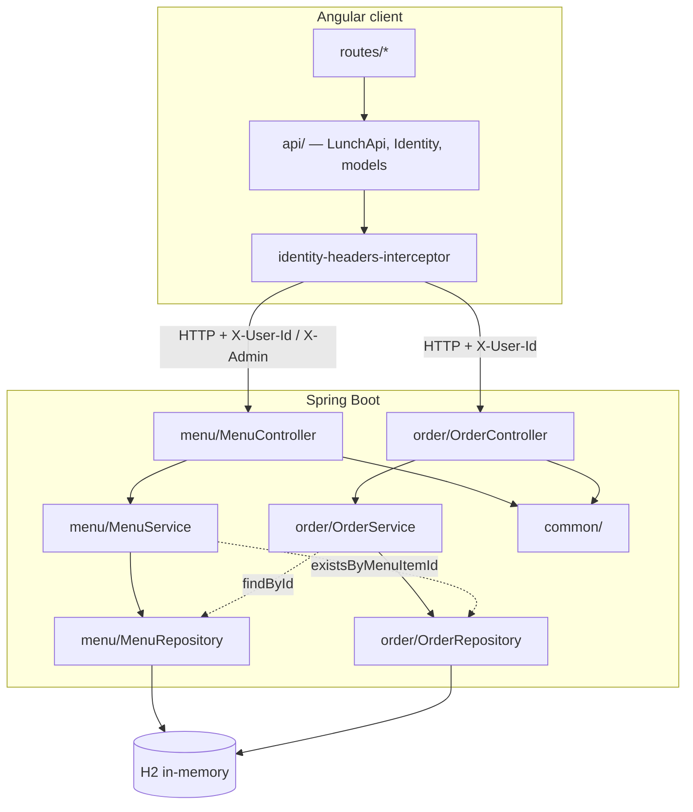
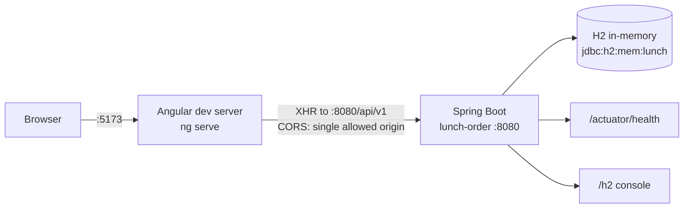
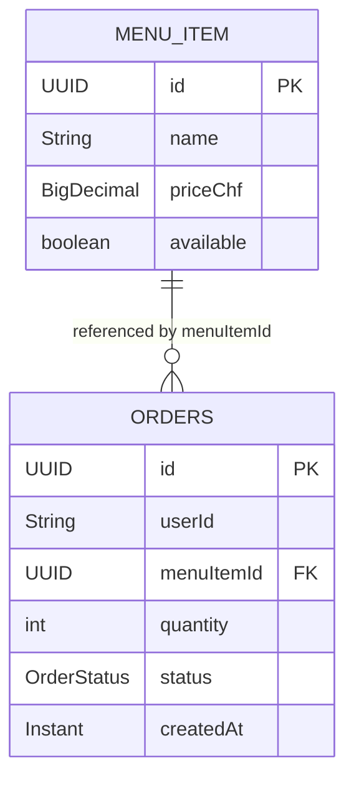

# Architecture Spine — Lunch Order API

## Design Paradigm

**Layered, feature-packaged.** Three layers, one package per business domain — not one package per layer.

| Layer | Responsibility | Namespace |
| --- | --- | --- |
| Controller | HTTP shape, headers, authorization | `ch.elca.training.lunch.<feature>` |
| Service | Business rules, invariant order | `ch.elca.training.lunch.<feature>` |
| Repository | Persistence (Spring Data JPA) | `ch.elca.training.lunch.<feature>` |
| Cross-cutting | Error envelope, CORS, seed data | `ch.elca.training.lunch.common` |

A feature package (`menu/`, `order/`) holds its entity, repository, service and controller side by side. `common/` holds only what every feature needs and no domain logic.

The frontend mirrors this by route, not by layer: one directory per route under `routes/`, with the HTTP boundary isolated in `api/`.

## Invariants & Rules



Solid edges are the permitted direction. Dotted edges are the two cross-feature reads permitted by AD-1 — note they run in **both** directions.

### AD-1 — Cross-feature access is repository-to-repository only

- **Binds:** all backend feature packages
- **Prevents:** a service calling another feature's service, which would put business rules behind two different front doors and make the call order in AD-5 unenforceable
- **Rule:** A service may inject another feature's **repository** and may only read through it. It must never inject another feature's **service**, and never write through a foreign repository. `MenuService` reads `OrderRepository.existsByMenuItemId`; `OrderService` reads `MenuRepository.findById`. Any further cross-feature need is a new repository query method, not a service call.

`[ASSUMPTION]` This ratifies what the code already does rather than fixing it. The consequence is a **package dependency cycle**: `menu → order` and `order → menu` hold simultaneously, so neither package can be extracted into its own module without breaking the other. Acceptable inside one Spring Boot artifact; the first genuine reason to split the deployable is the trigger to revisit. Correct me if you want the cycle broken instead — it would mean a domain event or a shared `availability` read model, and a refactor outside any story's AC.

### AD-2 — One error envelope, no exceptions

- **Binds:** every endpoint, every client
- **Prevents:** a client having to parse two error shapes — the domain's and Spring's
- **Rule:** Every non-2xx response body is `ApiError(String code, String message)` — flat, exactly two fields, both always populated. Framework-level failures are explicitly mapped in `common/GlobalExceptionHandler` so Spring's default `timestamp/status/error/path` body never reaches a client. A new failure mode ships with its `@ExceptionHandler` in the same change, or it is not done.

Mapped codes: `MISSING_USER`, `MALFORMED_BODY`, `INVALID_ID`, `INVALID_QUANTITY`, `INVALID_NAME`, `INVALID_PRICE`, `INVALID_INPUT`, `NOT_ADMIN`, `NOT_OWNER`, `MENU_ITEM_NOT_FOUND`, `MENU_ITEM_HAS_ORDERS`, `ORDER_NOT_FOUND`, `ALREADY_CANCELLED`.

### AD-3 — `message` is client-facing text, never diagnostics

- **Binds:** every `@ExceptionHandler`
- **Prevents:** parser internals, fully-qualified class names, or caller-supplied values leaking through a field the UI renders verbatim
- **Rule:** Domain exceptions may pass `ex.getMessage()` through, because their messages are authored for display. Framework exceptions must not: `HttpMessageNotReadableException` yields a fixed string (Jackson internals suppressed), and `MethodArgumentTypeMismatchException` echoes only the parameter *name* — never the offending value, never the target type.

### AD-4 — Authorization is enforced at the controller boundary, fail-closed

- **Binds:** every admin endpoint
- **Prevents:** a second, divergent admin check appearing in the service layer, and any value other than exact-match `true` being read as consent
- **Rule:** The admin check is the controller method's **first** statement and rejects anything that is not the exact string `true` — so `null`, `false`, and `TRUE` all fail closed with 403 `NOT_ADMIN`. Services stay unaware of admin status. There is no Spring Security filter chain; the controller is the only gate.

### AD-5 — State-changing checks run existence → ownership → state

- **Binds:** every mutation that resolves an entity by id on behalf of a caller
- **Prevents:** an ownership check leaking the existence of another user's record, and two stories choosing different orders
- **Rule:** In exactly this sequence: **authorization** (AD-4, in the controller) → **existence** 404 → **ownership** 403 → **state** 409. `OrderService.cancel` is the reference implementation for the last three — `OrderNotFoundException`, then `NotOrderOwnerException`, then `AlreadyCancelledException`. Authorization precedes existence deliberately: a caller who fails the admin check must not learn whether the id exists. `MenuService.deleteById` follows the same shape (admin in the controller, then existence, then the has-orders state check).

### AD-6 — Unavailability is concealed as absence

- **Binds:** `GET /api/v1/menu`, `POST /api/v1/orders`
- **Prevents:** one endpoint inventing `MENU_ITEM_UNAVAILABLE` while another 404s for the same condition
- **Rule:** An unavailable `MenuItem` is reported as `MENU_ITEM_NOT_FOUND` / 404. There is no distinct code and no distinct status. `GET /api/v1/menu` lists available items only (`findAllByAvailableTrue`); `OrderService.submit` throws `MenuItemNotFoundException` when `isAvailable()` is false. The exception's own message — *"not found or unavailable"* — is the only hint a client gets.

**Corollary for the UI:** do not build an availability indicator driven off `item.available` for the list endpoint. It would read `true` one hundred percent of the time.

### AD-7 — Exactly one read bypasses availability filtering

- **Binds:** `GET /api/v1/menu/{id}`; every client resolving a historical `menuItemId`
- **Prevents:** a client resolving names against the filtered list and silently losing items that have since gone unavailable
- **Rule:** `GET /api/v1/menu/{id}` uses `findById` and returns the item **regardless of `available`**. It is public — no `X-User-Id`, no `X-Admin`. It is the only supported way to resolve a `menuItemId` held on an `Order`. Clients must use it, not `GET /api/v1/menu`, for that job.

### AD-8 — Requests are validated records; responses are entities

- **Binds:** every endpoint's request and response types
- **Prevents:** validation annotations drifting between an entity and its request type, and a response DTO layer appearing for one feature only
- **Rule:** Inbound bodies bind to a dedicated `record` carrying `jakarta.validation` annotations (`CreateOrderRequest`, `CreateMenuItemRequest`), applied with `@Valid`. Outbound bodies serialize the JPA entity directly. The v1 "entity = API" rule applies to the **response direction only**; do not add response DTOs for one endpoint while others return entities.

### AD-9 — Identity is a header on every request, never a session

- **Binds:** all `/api/v1/orders/**` endpoints, all admin endpoints, the whole frontend
- **Prevents:** a client inventing a login flow, a token, or server-side session state that the backend cannot honor
- **Rule:** `X-User-Id: <employee-id>` identifies the caller and is **required** on every `/orders/**` endpoint — absent, it is 400 `MISSING_USER`, not 401. `X-Admin: true` grants admin. Nothing is authenticated, signed, or verified; the backend trusts both headers completely. There is no session, no cookie, no token.

**The v2 intent constrains v1's shape** (PRD §1.5, organizational constraint 3): the auth boundary is meant to move to an upstream reverse proxy or IdP that *sets* `X-User-Id` rather than accepting it from the client. Keep the header contract exactly as it is so that migration is a deployment change, not a code change. Concretely: never read identity from a body, a query parameter, or a path segment, and never add a second identity mechanism alongside the header.

### AD-10 — `X-Admin` is derived from the route, never from stored state

- **Binds:** the Angular client's HTTP boundary
- **Prevents:** a component opting itself into admin privileges, and admin headers leaking onto non-admin requests
- **Rule:** A single `HttpInterceptor` attaches both identity headers. `X-Admin: true` is added if and only if the router's current URL is under `/admin`. Admin-ness is never read from `localStorage`, a signal, or a service flag — deriving it from the active route makes "admin only on the admin route" true by construction. No component sets these headers itself.

### AD-11 — Reads use `httpResource`, mutations use `HttpClient`

- **Binds:** every frontend HTTP call
- **Prevents:** two components inventing different loading-state and refresh conventions
- **Rule:** GETs go through `httpResource`, which supplies `isLoading()` / `error()` / `hasValue()` signals and refreshes via `reload()`. POST / PATCH / DELETE go through `HttpClient` on the injectable `LunchApi`, subscribed explicitly by the caller. After a successful mutation, refresh by calling `reload()` on the affected resource — never by mutating a local copy of server state.

### AD-12 — One function turns an error into text, and it renders `message`

- **Binds:** every frontend view
- **Prevents:** each view formatting errors its own way, and `code` reaching the screen
- **Rule:** `apiErrorMessage()` is the only place an `HttpErrorResponse` becomes display text. It renders `ApiError.message` and never `ApiError.code`. It falls back to a generic string only when the payload is not an `ApiError` — status `0` is reported as "backend unreachable". No non-2xx response is silently swallowed.

### AD-13 — One allowed origin, so the dev-server port is load-bearing

- **Binds:** `common/WebConfig`, the frontend's `npm start` and `API_BASE`
- **Prevents:** a port change silently breaking every request with an opaque CORS failure
- **Rule:** The backend allows exactly one origin — `http://localhost:5173` — for `/api/**`. The frontend dev server is therefore **pinned** to 5173 (`ng serve --port 5173`) and calls the API at the absolute URL `http://localhost:8080/api/v1`. Changing either port means changing both. A dev-server proxy would make the port irrelevant and is the documented alternative; it was rejected so that the existing CORS config stays exercised.

### AD-14 — Schema is Hibernate's, and it is disposable

- **Binds:** both entities, every test
- **Prevents:** a migration tool being introduced for one feature, and tests assuming persisted data
- **Rule:** `ddl-auto: update` against `jdbc:h2:mem:lunch` is the entire schema lifecycle. There is no Flyway, no Liquibase, no checked-in DDL. Every restart is a fresh database seeded by `MenuSeedData`. No feature may depend on data surviving a restart.

### AD-15 — Domain bounds live on the entity; request records restate them

- **Binds:** every entity field with a constrained range, every request record binding to it
- **Prevents:** two write paths accepting different ranges for the same field, and a non-HTTP write path bypassing validation entirely
- **Rule:** A field's bounds are declared on the **entity** with `jakarta.validation` annotations, and every request record that writes it restates the same bounds. `MenuItem` already does this — `@NotBlank @Size(max = 100)` and `@PositiveOrZero` appear on both the entity and `CreateMenuItemRequest`.

`[ASSUMPTION]` **This AD is not yet satisfied.** `Order.quantity` is a bare `private int quantity;` with `@Column(nullable = false)` and no range constraint; `@Min(1) @Max(10)` lives only on `CreateOrderRequest`. So a second write path — a quantity-update endpoint, a bulk import, a test fixture — can persist `quantity = 0` or `quantity = 9999` and nothing objects. Bringing `Order` in line is a one-line change but sits outside any current story's AC, so it is recorded here rather than done. Tell me if you want it raised as a story.

### AD-16 — Validation codes are keyed by field name, globally

- **Binds:** every request record field, every feature adding one
- **Prevents:** silently believing a validation code is scoped to one feature when it is not
- **Rule:** `handleValidationErrors` maps a code from the **first** binding error's field name in one global `switch` — `quantity` → `INVALID_QUANTITY`, `name` → `INVALID_NAME`, `priceChf` → `INVALID_PRICE`, everything else → `INVALID_INPUT`. Two features with a field of the same name therefore **share one code** and cannot carry distinct codes for it. A new constrained field either accepts `INVALID_INPUT` or adds a case — and adding a case changes that field name's code for every feature at once. When a request has several invalid fields, only the first is reported.

A standing comment in `GlobalExceptionHandler` proposes deriving `INVALID_<FIELD>` automatically. That would remove the switch but not the global field-name keying, so it does not resolve this.

### AD-17 — `priceChf` scale is fixed at two decimal places

- **Binds:** `MenuItem.priceChf`, `CreateMenuItemRequest.priceChf`, every client rendering a price
- **Prevents:** `12.5`, `12.50` and `12.500` coexisting for one price — they serialize to different JSON, and `BigDecimal.equals` treats them as unequal even though `compareTo` says they match
- **Rule:** Compare prices with `compareTo`, never `equals`. Clients format to exactly two decimals for display and must not assume the JSON number carries a trailing zero.

`[ASSUMPTION]` **Not enforced in code.** There is no `@Digits`, no `columnDefinition`, and no normalization on write — `MenuService.addItem` stores whatever `BigDecimal` Jackson parsed. The frontend types `priceChf` as a plain `number`, which discards scale on arrival anyway. Fixing it properly means `@Digits(integer = 6, fraction = 2)` on both entity and request record plus a `setScale(2, HALF_UP)` on write. Recorded, not done.

### AD-18 — The server owns ordering; clients must not re-sort

- **Binds:** `GET /api/v1/orders/me`, every client rendering it
- **Prevents:** two orderings of one list — the server's and the client's — drifting apart, and a client's string comparison breaking when the timestamp serialization changes
- **Rule:** `findAllByUserIdOrderByCreatedAtDesc` already returns orders newest-first. A client renders that order as received. Ordering is not a client concern.

`[ASSUMPTION]` **The adopted spike violates this.** `my-orders-page` re-sorts with `b.createdAt.localeCompare(a.createdAt)` — a lexicographic string comparison over the serialized `Instant`. It happens to agree with the server today because Jackson emits fixed-width UTC ISO-8601, but it is a second sort mechanism for the same list and it breaks silently if the serializer ever emits an offset or variable fractional precision. Deleting the client-side sort is the fix; it is one line, inside story 2.1's scope.

## Consistency Conventions

| Concern | Convention |
| --- | --- |
| Feature packages | `ch.elca.training.lunch.<feature>` — one per domain, entity + repo + service + controller together. `common/` carries no domain logic. |
| Ids | `UUID`, `@GeneratedValue(strategy = GenerationType.UUID)`, never a sequence. `String` on the wire. |
| Money | `BigDecimal priceChf`, `@PositiveOrZero`, two decimal places (AD-17). Never `double`. Currency is implicit in the field name — there is no currency field, so multi-currency is a schema change, not a config change. |
| Timestamps | `Instant`, `@CreationTimestamp`, `updatable = false`. ISO-8601 UTC string on the wire. Ordering is the server's (AD-18). |
| Enums | Persisted `@Enumerated(EnumType.STRING)`, never ordinal. |
| Routes | All under `/api/v1`. Collection at `/menu`, `/orders`; admin writes at `/menu/items`. State transitions are `PATCH /{id}/<verb>`, not a status field in a body. |
| Status codes | 200 read, 201 create (with body), 204 mutation-without-body, 400 malformed or unvalidated, 403 wrong identity, 404 absent, 409 state conflict. |
| Error codes | `SCREAMING_SNAKE_CASE`, domain-first (`MENU_ITEM_HAS_ORDERS`), never an HTTP status name. |
| Exceptions | One `RuntimeException` subclass per failure mode, in the feature package that owns it; the message is authored for display (AD-3). Mapped in `GlobalExceptionHandler`. |
| Backend tests | `@WebMvcTest` for controllers, `@DataJpaTest` for repositories, plain unit tests with mocked repositories for services. `@SpringBootTest` is reserved for the one existing `contextLoads()` smoke test. |
| Frontend components | Standalone, `ChangeDetectionStrategy.OnPush`, `inject()` over constructor injection, `input()` over `@Input()`, native `@if` / `@for`. Selector prefix `lunch-`. |
| Frontend state | Signals. `computed()` for derived values. No RxJS subjects for view state; `rxjs` is present only as Angular's own dependency. |
| Frontend routes | Lazy `loadComponent`, one directory per route under `routes/`, wildcard redirects to `/`. |
| Frontend tests | `vitest` + `jsdom`, one `.spec.ts` beside each route component. |

## Stack

The code owns these once it exists. Support status checked against `endoflife.date` on 2026-09-03; the rows marked *unverified* were read from `pom.xml` / `package.json` and not independently support-checked.

| Name | Version | Status as of 2026-09-03 |
| --- | --- | --- |
| Java | 21 (LTS) | Supported — Premier Support to 2030-09-30. **Not the newest LTS**: Java 25 has held that since 2025-09-16. No pressure to move. |
| Spring Boot | 3.5.0 | **OSS support for the 3.5 line ended 2026-06-30.** Latest 3.5 patch is 3.5.16; current line is 4.1.1 (2026-08-21). Frozen deliberately — see Deferred. |
| Spring Data JPA / Validation / Actuator / Web | managed by the Boot parent | No independent pins — they move with the Boot version. |
| H2 | managed by the Boot parent | `runtime` scope, in-memory only. *Unverified.* |
| Maven | wrapper (`./mvnw`) | *Unverified.* |
| Angular | 21.2 (`^`, resolves to 21.2.22) | Active support ended 2026-06-03; **in LTS to 2027-06-30.** Angular 22.1.5 is current. Acceptable pin. |
| TypeScript | 5.9.2 | *Unverified.* |
| vitest | 4.0.8 | With `jsdom` 28. *Unverified.* |
| npm | 11.6.2 | Declared via `packageManager`. *Unverified.* |
| Angular CLI / build | 21.2.19 | Moves with Angular. |

## Structural Seed





`MenuSeedData` seeds four items at boot, guarded by `count() == 0` and disabled under `@Profile("!test")`. One of the four — *Soupe du jour* — is seeded `available = false` **on purpose**: it is the only fixture that makes AD-6 and AD-7 observable at runtime, since it appears in `GET /api/v1/menu/{id}` but not in `GET /api/v1/menu`. Do not "fix" it to `true`.

`menuItemId` is a plain `UUID` column, **not** a JPA `@ManyToOne`. There is no object graph, no cascade, and no database-level foreign key constraint. Referential integrity is enforced in application code only: `MenuService.deleteById` refuses to delete an item that any order references (409 `MENU_ITEM_HAS_ORDERS`). This is why a client must resolve names through AD-7 rather than a nested object.

```text
AI-Training/
  src/main/java/ch/elca/training/lunch/
    LunchOrderApplication.java
    common/      # ApiError, GlobalExceptionHandler, WebConfig — no domain logic
    menu/        # MenuItem, MenuRepository, MenuService, MenuController,
                 # CreateMenuItemRequest, MenuSeedData, 3 exceptions
    order/       # Order, OrderStatus, OrderRepository, OrderService,
                 # OrderController, CreateOrderRequest, 3 exceptions
  src/main/resources/application.yml
  src/test/java/ch/elca/training/lunch/   # mirrors the main tree
  frontend-angular/
    src/app/
      api/       # models, LunchApi, Identity, identity-headers-interceptor
      components/# shared presentational only (ErrorBanner)
      routes/    # one directory per route: menu-page, my-orders-page, admin-page
```

## Capability → Architecture Map

| Capability | Lives in | Governed by |
| --- | --- | --- |
| 1.1 List today's menu | `menu/MenuController#listMenu` | AD-2, AD-6, AD-8, AD-17 |
| 1.2 Submit an order | `order/OrderController#submit` | AD-1, AD-5, AD-6, AD-8, AD-9, AD-15 ⚠ |
| 1.3 List my orders | `order/OrderController#listMine` | AD-8, AD-9, AD-18 |
| 1.4 Cancel one of my orders | `order/OrderService#cancel` | **AD-5** (reference implementation), AD-9 |
| 1.5 Admin adds a menu item | `menu/MenuController#add` | AD-4, AD-8, AD-16, AD-17 ⚠ |
| 1.8 Admin deletes a menu item | `menu/MenuService#deleteById` | AD-1, AD-4, AD-5 |
| 2.7 Get a menu item by id | `menu/MenuController#getById` | **AD-7** |
| 2.1 Menu view + order form | `routes/menu-page` | AD-11, AD-12, AD-13 |
| 2.1 My orders view + cancel | `routes/my-orders-page` | **AD-7** ⚠, AD-11, AD-12, **AD-18** ⚠ |
| 2.1 Admin view | `routes/admin-page` | AD-10, AD-11, AD-12 |
| 2.1 Identity handling | `api/identity`, `api/identity-headers-interceptor` | AD-9, AD-10 |

⚠ marks a capability whose current code does **not** yet satisfy the listed AD. Four in total: AD-15 (`Order.quantity` unbounded on the entity), AD-17 (`priceChf` scale unenforced), AD-7 and AD-18 (both in `my-orders-page`). The last two sit inside story 2.1's scope; the first two do not sit inside any current story.

## Divergence from Source Inputs

This spine knowingly contradicts two of its own sources. Both need an upstream fix, not a spine change.

| Source | What it says | Why this spine diverges |
| --- | --- | --- |
| `prd.md` §1.4 Out of Scope, item 5 | *"**Frontend** — No web UI, no mobile app. API-only deliverable."* | Feature 2 is a browser client. The PRD is dated 2026-05-11 and predates Feature 2 entirely; the exclusion is stale, not a decision being overridden. **The PRD needs updating** — otherwise the whole frontend is being built against a document that forbids it. |
| `2-1-frontend-v1.md` AC 2.1.1, AC 2.1.2 | Scaffold `frontend/` via `npm create vite@latest frontend -- --template react-ts`; boot the Vite dev server. | Feature 2 adopts the Angular 21 spike instead (decision of 2026-09-03). Both ACs are now false as written, and the deliverable lives in `frontend-angular/`, not `frontend/`. **Story 2.1 needs its ACs rewritten** before it can be implemented or verified against. |

`docs/tech-spec.md` is a third case, but a simpler one: it is the May-11 Phase 3 artefact this spine supersedes. It describes a backend-only system, omits CORS, `WebConfig`, `GET /menu/{id}` and `DELETE /menu/items/{id}`, and lists a package layout missing six exception classes. It should be marked superseded rather than reconciled.

## Testability

Against the ELCA ADR Quality Readiness criteria:

| Criterion | Status |
| --- | --- |
| Each unit testable in isolation | **Yes.** Services take repositories by constructor injection and are unit-tested with mocks; controllers are tested under `@WebMvcTest` with the service mocked; repositories under `@DataJpaTest`. |
| Business logic reachable without the UI | **Yes.** The frontend adds no rules. Every invariant in AD-2 through AD-9 is enforced server-side and exercisable over HTTP with two headers and `curl`. |
| Seeding API for test data | **CONCERNS.** `MenuSeedData` seeds at boot and is not addressable at runtime; there is no seed endpoint. `@DataJpaTest` and `@WebMvcTest` construct their own fixtures, so this blocks only end-to-end testing. |
| Test data segregated per environment | **N/A by construction.** One in-memory H2 per JVM, discarded on exit (AD-14). No shared environment exists to contaminate. |
| Bruno `.bru` collections in the repo | **CONCERNS — absent.** No API collection is checked in. The thirteen error codes in AD-2 and the check order in AD-5 are exactly what a `.bru` collection should pin, and today only JUnit covers them. |

Two CONCERNS flags. Neither blocks the workshop; both would block a real QG2.

## Deferred

| Deferred | Why it can wait |
| --- | --- |
| **Spring Boot 3.5 → 4.1** | The 3.5 line is out of OSS support, which would be a finding in a real project. Here the pin is deliberate: `CLAUDE.md` forbids touching `pom.xml`, and every story's expected output assumes this version. Revisit when the workshop's Spring Boot baseline is refreshed, not inside a story. |
| **Angular 21 → 22** | 21 is in LTS to 2027-06-30, so there is no support pressure before then. Revisit if a story needs a 22-only API. |
| **Breaking the `menu ↔ order` cycle** | See AD-1. Costs a domain event or a shared read model, and a refactor outside any story's AC. Trigger: the first genuine reason to split the deployable. |
| **403-before-400 ordering** | Needs a `HandlerInterceptor` to run before `@Valid`. Known, documented in `MenuController`, and accepted: a client must not infer authorization state from a 400. Trigger: the first endpoint where the leak actually matters. |
| **Response DTOs** | AD-8 fixes entity-as-response for v1. Trigger: the first field that must not reach a client — `Order.userId` is the likely first. |
| **Deployment, environments, CI, infrastructure** | Nothing to decide. This is a local workshop repo: H2 in memory, GitHub rather than Bitbucket, no OKD project, no cloud subscription, no pipeline. The ELCAi rule that infrastructure must align with the ELCA DevOps platform has nothing to bind to, so it is recorded as absent rather than invented. Trigger: a real deployment target. |
| **Availability toggle endpoint** | AD-6 conceals unavailability and `MenuItemHasOrdersException` directs admins to a toggle — which does not exist. Story 2.2 owns it. |
| **AC 2.1.5 name resolution** | AD-7 says resolve historical `menuItemId` through `GET /api/v1/menu/{id}`, cached per id. The adopted spike instead reads `GET /api/v1/menu` and falls back to a truncated id, so an order for a since-unavailable item shows no name. Real work, owned by story 2.1, not deferrable indefinitely. |
| **Frontend test parity** | `my-orders-page` has no `.spec.ts` despite owning the cancel flow and the sort logic AD-18 says to delete. Owned by story 2.1. |
| **`Order.quantity` bounds on the entity (AD-15)** | One annotation, but it belongs to no current story and `CLAUDE.md` forbids refactors outside a story's AC. Trigger: a second write path for `quantity`, or raise it as a story. |
| **`priceChf` scale enforcement (AD-17)** | Needs `@Digits` on two types plus `setScale` on write. Same story-scope obstacle as AD-15. Trigger: the first price that round-trips wrong, or a report that sums prices. |
| **Per-feature validation codes (AD-16)** | The field-name-keyed global switch is a real constraint, not a bug worth fixing now — nothing today needs two features to disagree about a field called `name`. Trigger: the first feature that does. |
| **Admin visibility rules** | AD-8 returns `Order` entities including `userId`, and AD-9 verifies nothing, so any caller can read any user's orders by changing one header. Correct for mock auth and wrong for anything else. There is no AD governing what an admin-facing endpoint may return, because no admin read endpoint exists yet. Trigger: the first one. |
| **`userId` as PII — retention and deletion** | PRD §1.5 regulatory constraint 1 holds `userId` to be PII under nLPD / revFADP and calls for a retention policy and a deletion path. Neither exists, and AD-8 returns `userId` in every order response. The PRD's own open question 2 (*"keep forever? anonymise after X days?"*) is unanswered and assigned to Legal + IT Security. No AD can be written until it is answered. Trigger: an answer, or any deployment outside a laptop. |
| **Pagination, caching, rate limiting, observability beyond `/actuator/health`, OpenAPI generation** | No requirement and no scale. Trigger: a story that names one. |
